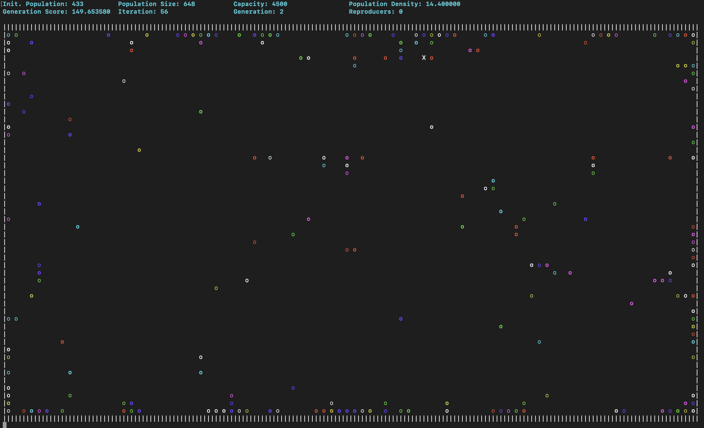
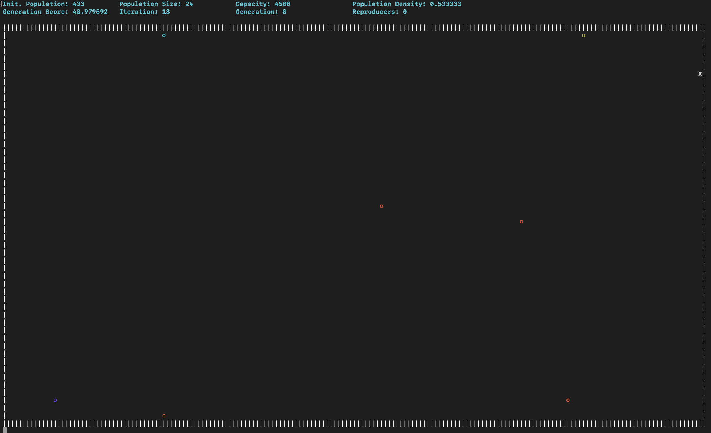
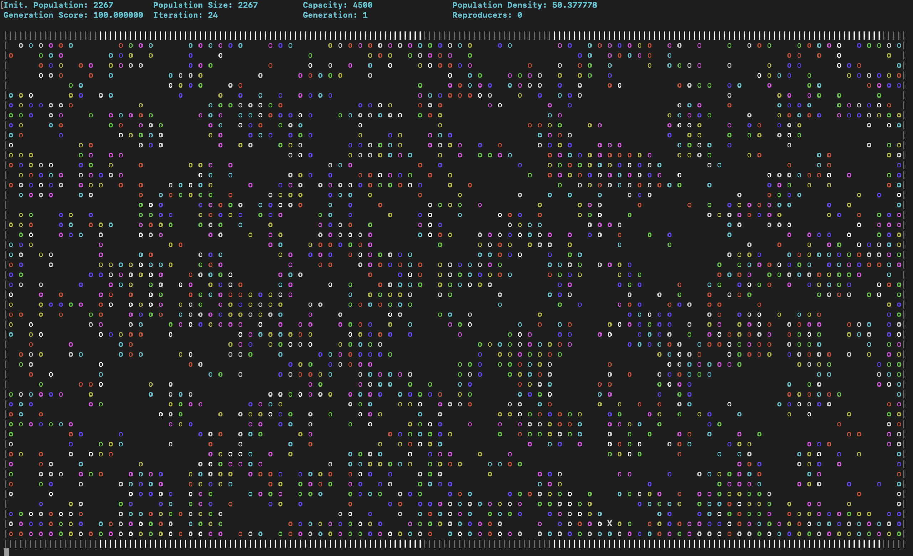

# Evolution Simulation

## How to run?  
You can run the main.cpp. There are no dependencies.
  
Linux & Unix:  
```bash
cd "path/to/folder/Evolution-Simulation/" && g++ -std=c++17 main.cpp -o main && "path/to/folder/Evolution-Simulation/"main
```

## Introduction
This project is a simulation of the evolution of a population of creatures. The creatures are represented by a neural network. The creatures are controlled by the neural network (connection between neurons). The creatures are placed in a 2D world. 

## Creatures
The creatures are represented by a neural network. 
It contains the information of the creature such as the position and the table.

## Neural Network
By using weights and biases, the neural network can determine whether the action will happen or not for each neuron.

## Genome
The genome is the genetic information of the creature. This controls the actions of the creature. It contains the information of connections between neurons.  

## Neurons
The neurons are the nodes of the neural network. The neurons are connected to each other. There are different types of neurons like
- Left Eye
- Right Eye
- Top Eye
- Bottom Eye
- Go Left
- Go Right
- Go Up
- Go Down
- Inner Neuron
- Kill (Incomplete)

Input Neuron: The input neuron is the neuron that receives the input from the world. The input neuron is connected to the creature.
Output Neuron: The output neuron is the neuron that sends the output to the world and takes any action like moving the creature. The output neuron is connected to the creature.

## Evolution
The creatures will be placed in the world. The creatures will be given a random DNA. The DNA will be used to create the neural network. The neural network will be used to control the creature. The creature will live or die based on world conditions, then creatures who live will earn to reproduce. Reproduces will genenerate next generation with cross-over and mutation.

## Reproduction
### Survival Spot  
There are the many modes how the reproducers will choosen. Some modes are Righ-Half, Left-Half, etc. For example for Right-Half, right-half of the screen choosen as reproducers.
### Reproduction Types  
There are 3 types of reproduction so far. Survivalist, Constant Population, and Elitist. 
- Survivalist: The classic reproduction type. Based on nature, in this reproduction type. Next generation will be same number as choosen reproducers.
- Constant Population: The population will be constant. The next generation will be same number as the current generation. But choose method of the reproducers will be same.
- Elitist: The parents will not die. For every two parent, one child and one parent will be added to the next generation.

### Note
Reproduction is problematic. Crossover is happening with irrelevant connections, thus causing loss of genetic information of the reproducers in newer generations. This prevents the individual's DNA to converge!

## Simulation




